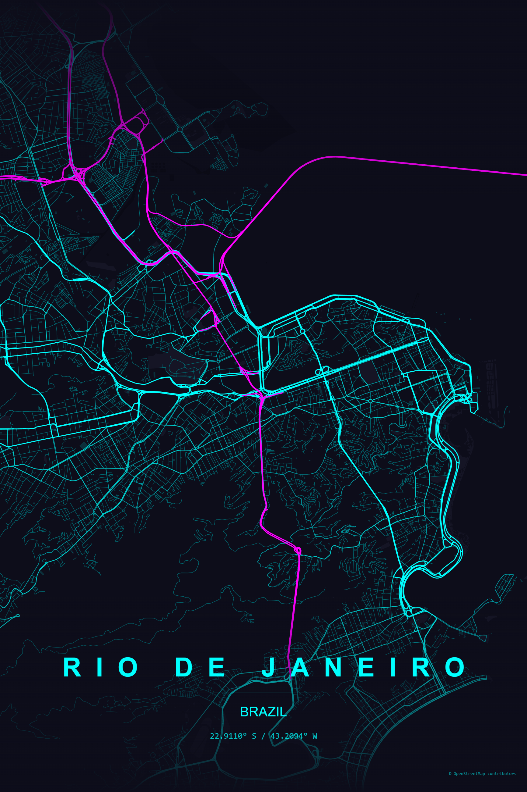
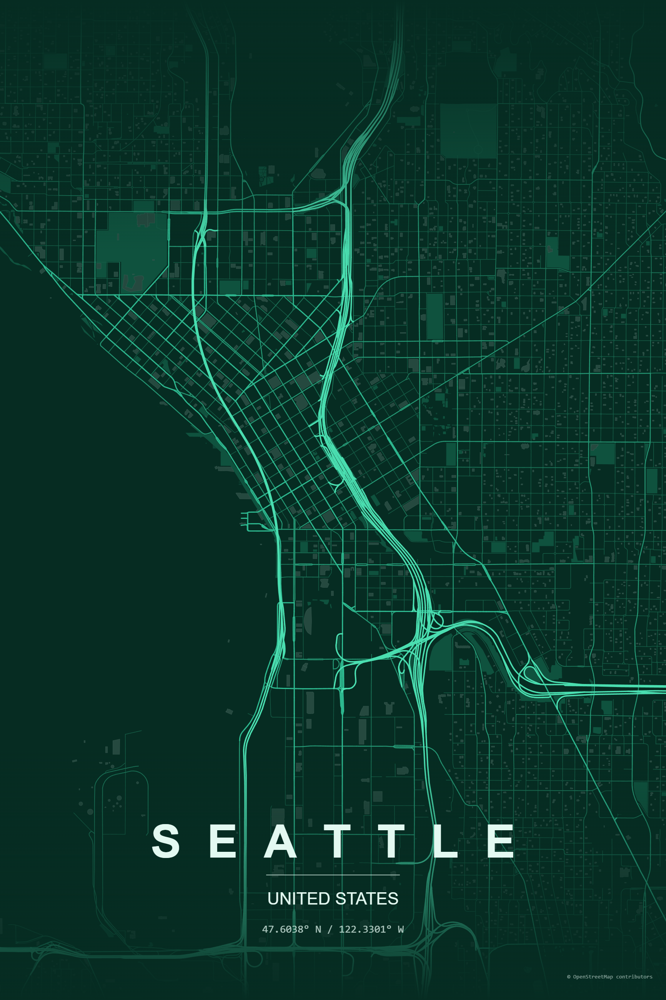
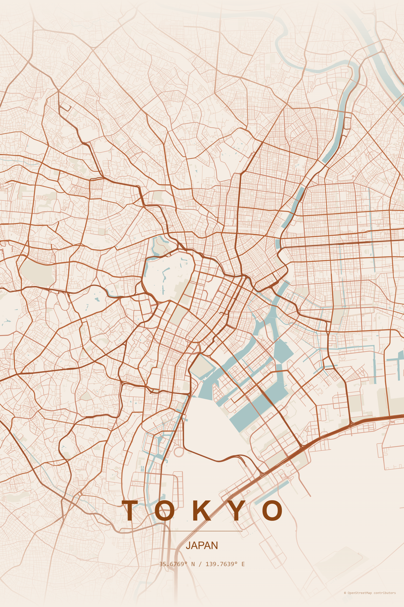
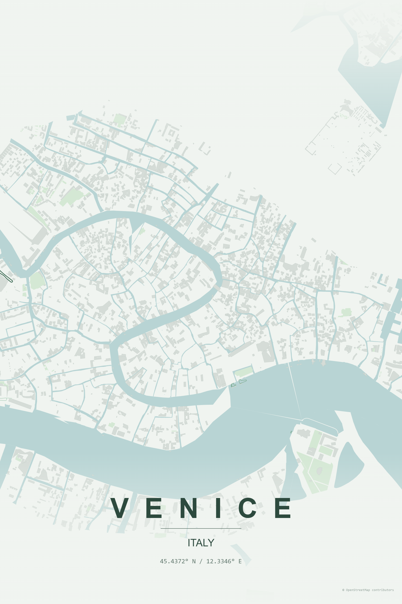
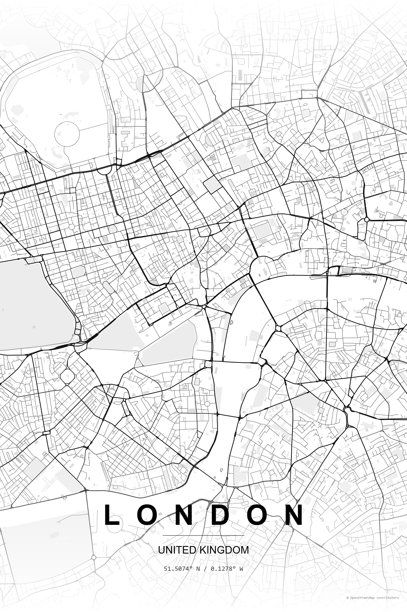
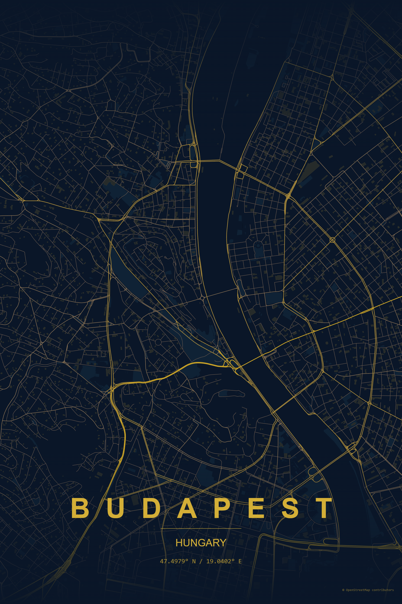

# TerraInk

[](https://bun.sh)
[](https://vitejs.dev)
[](https://react.dev/)
[](https://developer.mozilla.org/en-US/docs/Web/JavaScript)
[](https://www.typescriptlang.org)
[](https://www.openstreetmap.org)
[](https://opensource.org/licenses/MIT)

TerraInk: The Cartographic Poster Engine

App link: [https://terraink.app](https://terraink.app)

> Note: TerraInk is still in development. I appreciate every feedback. This is a for-fun, open-source project, and community contributions are very welcome.

## Aknowledgment

This project is a JavaScript reimplementation inspired by the original MapToPoster [originalankur/maptoposter](https://github.com/originalankur/maptoposter) by [Ankur Gupta](https://github.com/originalankur) (MIT license). My app is built using Bun, React, and TypeScript. It allows users to create custom city map posters with various styling options, leveraging OpenStreetMap data for accurate and detailed maps.

## User Interface


## Showcase

All showcase images are stored in `public/assets/screenshots/`.

### Featured Examples

<p align="center">
  
  
    
  
     
  
</p>

## Run

```bash
bun install
bun run dev
```

## Build

```bash
bun run build
```

## Deploy with Docker

### 1) Build and run with Docker Compose

Create `.env` from `.env.example` (or set `APP_PORT` directly in your shell), then run:

```bash
docker compose up -d --build
```

This serves the app on `http://localhost:7200` by default.

To change the exposed host port:

- Linux/macOS:

```bash
APP_PORT=80 docker compose up -d --build
```

- PowerShell:

```powershell
$env:APP_PORT=80
docker compose up -d --build
```

### 2) Stop the deployment

```bash
docker compose down
```

### 3) Optional: build and run without Compose

```bash
docker build -t terraink:latest .
docker run -d --name terraink -p 7200:80 --restart unless-stopped terraink:latest
```

## Features

- City + country geocoding via Nominatim (or manual lat/lon override)
- OpenStreetMap feature loading via Overpass API
- Theme system with customizable colors and styles
- Roads, water, parks, and building footprint rendering
- Typography controls for display labels and optional Google Font family
- PNG export

## Contributing

Contributions are welcome. Keep changes focused and open a pull request with:

- A short summary of what changed and why
- Screenshots for UI changes
- Notes on how you tested (`bun run build` at minimum)
