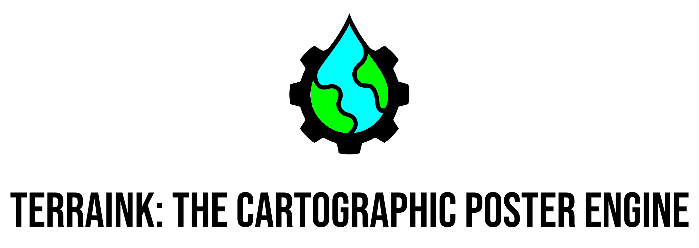
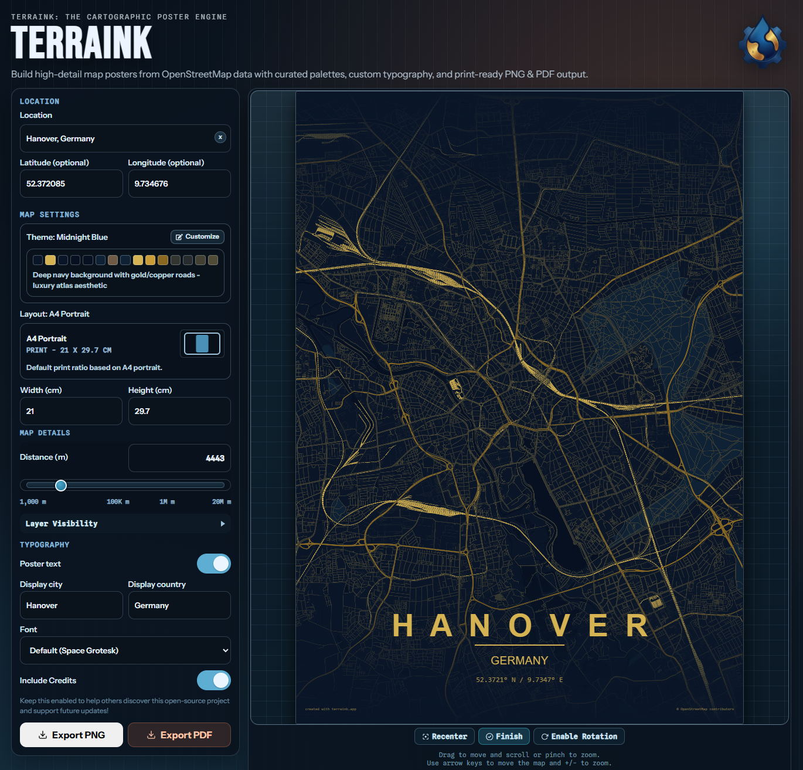
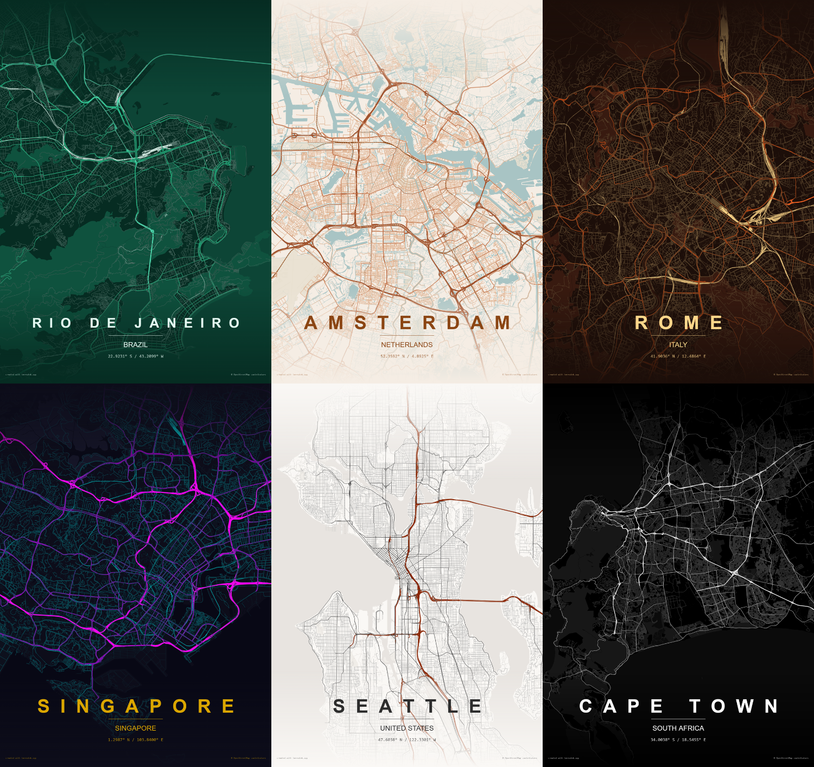

# TerraInk

[](https://terraink.app)
[](mailto:info@terraink.app)
[](https://www.linkedin.com/company/terraink/)
[](https://instagram.com/terraink.app)
[](https://www.youtube.com/@terrainkapp)
[](https://www.threads.net/@terraink.app)
[](https://www.reddit.com/r/terraink)
[](https://www.tiktok.com/@terraink.app)
[](https://www.producthunt.com/products/terraink)

[](https://bun.sh)
[](https://vitejs.dev)
[](https://react.dev/)
[](https://developer.mozilla.org/en-US/docs/Web/JavaScript)
[](https://www.typescriptlang.org)
[](https://www.openstreetmap.org)
[](https://github.com/yousifamanuel/terraink)
[](https://www.cloudflare.com)
[](https://www.docker.com)

> Note: TerraInk is still in development. Every feedback is appreciated. This is a for-fun, open-source project, and community contributions are very welcome.

## Aknowledgment

This project is a JavaScript reimplementation inspired by the original MapToPoster [originalankur/maptoposter](https://github.com/originalankur/maptoposter) by [Ankur Gupta](https://github.com/originalankur) (MIT license). My app is built using Bun, React, and TypeScript. It allows users to create custom city map posters with various styling options, leveraging OpenStreetMap data for accurate and detailed maps.

## User Interface



## Showcase

All showcase images are stored in `public/assets/screenshots/`.

### Featured Examples

<p align="center">
  
  
</p>

## Run

```bash
bun install
bun run dev
```

## Environment

Configure these values in `.env` (see `.env.example`):

- `VITE_REPO_URL`: Repository link shown in the sidebar
- `VITE_REPO_API_URL`: GitHub API endpoint used to fetch star count
- `VITE_CONTACT_EMAIL`: Contact email shown in the footer (`mailto:` link)
- `VITE_LEGAL_NOTICE_URL`: Imprint/legal notice page URL
- `VITE_PRIVACY_URL`: Data privacy page URL

## Build

```bash
bun run build
```

## Deploy with Docker

### 1) Build and run with Docker Compose

Create `.env` from `.env.example` (or set `APP_PORT` directly in your shell), then run:

```bash
docker compose up -d --build
```

This serves the app on `http://localhost:7200` by default.

To change the exposed host port:

- Linux/macOS:

```bash
APP_PORT=80 docker compose up -d --build
```

- PowerShell:

```powershell
$env:APP_PORT=80
docker compose up -d --build
```

### 2) Stop the deployment

```bash
docker compose down
```

### 3) Optional: build and run without Compose

```bash
docker build -t terraink:latest .
docker run -d --name terraink -p 7200:80 --restart unless-stopped terraink:latest
```

## Features

- City + country geocoding via Nominatim (or manual lat/lon override)
- OpenStreetMap feature loading via Overpass API
- Theme system with customizable colors and styles
- Roads, water, parks, and building footprint rendering
- Typography controls for display labels and optional Google Font family
- PNG export

## Star History

[](https://star-history.com/#yousifamanuel/terraink&Date)

## Contributing

Contributions are welcome.

Please follow this flow:

1. Pick an existing issue, or open a new issue first to discuss the bug/feature.
2. Implement the fix/feature in a focused change.
3. Open a pull request after the work is complete.
4. Run tests/checks before opening the PR (`bun run build` at minimum) and verify everything works.
5. If possible, add a small screenshot for UI updates.

Code quality expectations:

- Keep code clean, readable, and reusable.
- If something is used in multiple places, extract it into a shared component.
- Reuse existing components when they already cover the use case.
- Prefer short, focused functions over long functions.
- Compose small functions/components through clear abstractions and interfaces.
- Follow naming conventions consistently.
- Add concise comments where the intent is not obvious.
