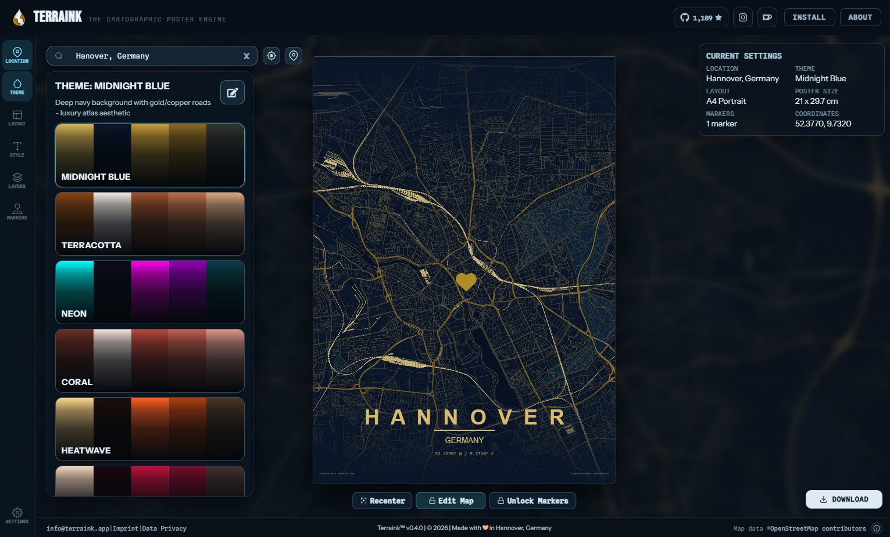
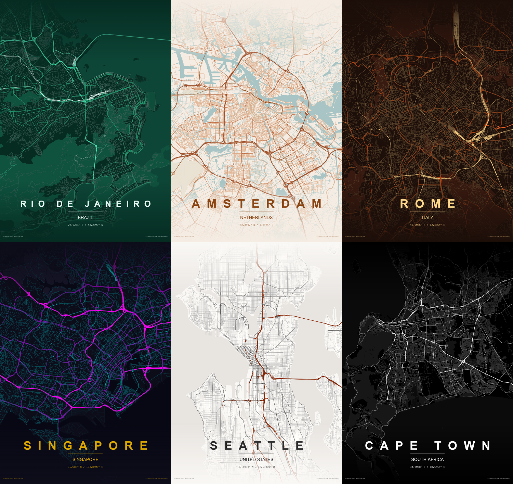

# Terraink

[](https://terraink.app)
[](mailto:hello@terraink.app)
[](https://www.linkedin.com/company/terraink/)
[](https://instagram.com/terraink.app)
[](https://www.youtube.com/@terrainkapp)
[](https://www.threads.net/@terraink.app)
[](https://www.reddit.com/r/terraink)
[](https://www.tiktok.com/@terraink.app)
[](https://www.producthunt.com/products/terraink)

[](https://bun.sh)
[](https://vitejs.dev)
[](https://react.dev/)
[](https://developer.mozilla.org/en-US/docs/Web/JavaScript)
[](https://www.typescriptlang.org)
[](https://www.openstreetmap.org)
[](https://maplibre.org/)
[](https://github.com/yousifamanuel/terraink)
[](https://www.cloudflare.com)
[](https://www.docker.com)

> Note: Terraink is still in development. Every feedback is appreciated. This is an open-source project, and community contributions are very welcome.

> **License & Trademark Notice:** This project is licensed under AGPL-3.0 and includes trademark protections. See the [License](#license) and [Trademark](#trademark) sections for details.

## Features

- **Custom city map posters** for any location in the world, powered by real OpenStreetMap data
- **Smart geocoding** — search for any city or region by name, or enter coordinates manually
- **Rich theme system** — choose from dozens of curated themes or build your own custom color palette
- **Detailed map layers** — roads, water bodies, parks, and building footprints with per-layer styling
- **Typography controls** — set city/country display labels and load any Google Fonts family
- **High-resolution PNG export** — download a print-ready poster at any defined dimension

## Data Providers and Mapping Stack

- **Map data**: [OpenStreetMap contributors](https://www.openstreetmap.org/copyright)
- **Tiles**: [OpenMapTiles](https://openmaptiles.org/)
- **Tile hosting**: [OpenFreeMap](https://openfreemap.org/)
- **Geocoding**: [Nominatim](https://nominatim.openstreetmap.org/)
- **Map renderer**: [MapLibre](https://maplibre.org/)

## User Interface



## Showcase

### Featured Examples

<p align="center">
  
  
</p>

## License

As of **April 3rd 2026**, all new changes to this repository are licensed under [AGPL-3.0](LICENSE). Code released before that date remains under the [MIT License](LICENSE-OLD).

The hosted Terraink service includes attribution and branding as part of the user interface.

If you deploy or modify the open-source version, you are responsible for complying with the AGPL-3.0 license, including preserving license and copyright notices.

For access to the hosted version with additional features and support, see Terraink Business or contact: [business@terraink.app](mailto:business@terraink.app).

## Trademark

Terraink™ is a trademark of Yousuf Amanuel. An application for registration has been filed with the German Patent and Trade Mark Office (DPMA). This filing establishes priority rights under the Paris Convention, allowing international trademark registration to be pursued within six months of the original filing date. The Terraink logo, visual identity, and branding assets are copyright © 2026 Yousuf Amanuel. All rights reserved.

Unauthorized use of the Terraink name in connection with similar software, map services, or related commercial products may be restricted. For licensing inquiries, contact [business@terraink.app](mailto:business@terraink.app).

See [TRADEMARK.md](./TRADEMARK.md) for details.

## Run

```bash
bun install
bun run dev
```

## Environment

Check [`.env.example`](./.env.example) for available variables. They are optional for most local work and should not be set during testing unless a specific case requires them.

## Build

```bash
bun run build
```

## Deploy with Docker (Self-Hosting)

### 1) Build and run with Docker Compose

Create `.env` from `.env.example` (or set `APP_PORT` directly in your shell), then run:

```bash
docker compose up -d --build
```

This serves the app on `http://localhost:7200` by default.

To change the exposed host port:

- Linux/macOS:

```bash
APP_PORT=80 docker compose up -d --build
```

- PowerShell:

```powershell
$env:APP_PORT=80
docker compose up -d --build
```

### 2) Stop the deployment

```bash
docker compose down
```

### 3) Optional: build and run without Compose

```bash
docker build -t terraink:latest .
docker run -d --name terraink -p 7200:80 --restart unless-stopped terraink:latest
```

## Contributing

> The contribution guidelines are meant to keep Terraink easy to extend, review, and maintain over time. They are here to support a durable architecture, not to add unnecessary friction.

Read [CONTRIBUTING.md](./CONTRIBUTING.md) before opening a PR.

- Branch from `dev` and target `dev` only. Do not open PRs against `main`.
- Fill out the pull request template completely when you open a PR.
- Keep contributions clean, modular, and aligned with the existing architecture.
- Avoid hard-coded values when constants, configuration, or reusable abstractions are more appropriate.
- AI-assisted coding is allowed, but submissions must be reviewed, refined, and intentionally engineered before review.

## Attribution

- **Map data**: © [OpenStreetMap contributors](https://www.openstreetmap.org/copyright), licensed under [ODbL](https://opendatacommons.org/licenses/odbl/)
- **Tile schema**: © [OpenMapTiles](https://openmaptiles.org/), licensed under [ODbL](https://openmaptiles.org/docs/tileset/openmaptiles/)
- **Tile hosting**: [OpenFreeMap](https://openfreemap.org/)
- **Geocoding**: [Nominatim](https://nominatim.openstreetmap.org/) / OpenStreetMap data
- **Map renderer**: [MapLibre GL JS](https://maplibre.org/), licensed under [BSD-3-Clause](https://github.com/maplibre/maplibre-gl-js/blob/main/LICENSE.txt)

## Acknowledgment

Terraink was inspired by [MapToPoster](https://github.com/originalankur/maptoposter) by [Ankur Gupta](https://github.com/originalankur), originally released under the MIT license. Terraink is an independent reimplementation built from scratch using Bun, React, and TypeScript, and has since evolved significantly beyond the original concept.

## Star History

[](https://star-history.com/#yousifamanuel/terraink&Date)
